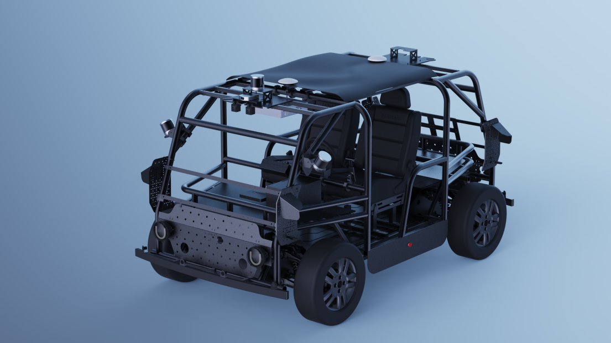

# What's inside

This manual aims to help users quickly get started with the DTV Kit. It provides instructions on operating and controlling the vehicle, and outlines usage guidelines and safety precautions to ensure proper operation and to extend the platform's service life.

## Contents

- [Product Unboxing Guide](product-unboxing-guide.md)
- [Hardware and Management](hardware-and-management.md)
- [Autonomous Driving Software](autonomous-driving-software.md)
- [Safety Operation and Maintenance](safety-operation-and-maintenance.md)
- [Disclaimer](disclaimer.md)
- [Attachments](attachments.md)

## Overview

The DTV Kit features a fully autonomous driving vehicle, designed for developers, universities, and research institutions. It serves as a comprehensive teaching kit, dedicated to cultivating talent in the autonomous driving field and supporting the global academic and research communities. The platform accommodates both closed-loop autonomous driving scenarios and modular secondary development, delivering a highly adaptable solution for educational and research purposes.

### Open platform
DTV is an industry-first open autonomous driving educational vehicle that transforms the traditionally closed "black-box" system into a transparent "white-box" model. By fully exposing the drive-by-wire protocol, sensor drivers, and complete software stack, it enables users to delve into the principles and inner workings of each module. 

### Designed for teaching and research
Designed to meet the needs of both academic and industry training programs, DTV is a flexible and scalable platform for cultivating talent in autonomous driving. It enables users to interact with and experiment across various components of the system.

### Robust configuration
The DTV is built on a robust skateboard chassis, offering both structural strength and a sleek, futuristic aesthetic. Its high-strength metal truss enhances durability, while the thoughtfully designed sensor layout — including cameras, LiDARs, and navigation systems — ensures a wide field of view. Precise sensor calibration techniques contribute to reliable and accurate data output. Additionally, a quick-attach mounting system allows for easy sensor configuration and expansion.

### Flexibile driving modes
The DTV offers four driving modes to support a range of testing and development needs: autonomous driving using Autoware; manual driving via a steering wheel and pedals; teleoperation using an industrial remote control: and remote operation. These modes give users the flexibility to select the most appropriate option for their specific use case, whether in research, development, or testing scenarios.

```{toctree}
:maxdepth: 1
:caption: Contents

product-unboxing-guide.md
hardware-and-management.md
autonomous-driving-software.md
safety-operation-and-maintenance.md
disclaimer.md
attachments.md
